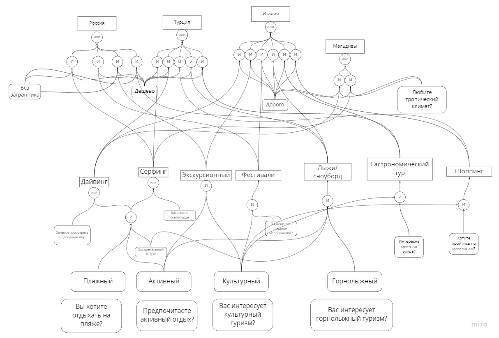

# Отчет по лабораторной работе
## по курсу "Искусственый интеллект"

### Студенты: 

| ФИО       | Роль в проекте                     | Оценка       |
|-----------|------------------------------------|--------------|
| Ежов Никита  | Создание диаграммы, реализация интерфейса работы ЭС с пользователем, ответственный за взаимодействие с библиотекой PyKnow |          |
| Тарпанов Даниил |Создание диаграммы, перевод правил из диаграммы в программный код |       |
| Синицын Илья|Создание диаграммы, тестирование программы|      |
| Фавстова Александра   |Создание диаграммы, написание отчёта |          |

## Результат проверки

| Преподаватель     | Дата         |  Оценка       |
|-------------------|--------------|---------------|
| Сошников Д.В. |              |     4.3          |

> *База знаний достаточно проста. При прямом выводе и вопрос-ответном интерфейсе непонянтно, как избавиться от нерелевантных вопросов.*

## Тема работы

Нам было задано придумать предметную область и на ее основе реализовать собственную экспертную систему, которая помогала бы пользователям решать поставленные задачи. За основу мы решили взять тему путешествий и придумали экспертную систему по выбору места отдыха. Пользователь должен будет отвечать на поставленые вопросы. После обрабоки ответов экспертная система порекомендует пользователю страну для отдыха. 

## Концептуализация предметной области

Опишите результаты концептуализации предметной области:
 - выделенные понятия: Вид отдыха, бюджет, предпочтения
 - тип получившейся онтологии - иерархия
 - статические знания
 

Приведите графические иллюстрации:


## Принцип реализации системы

Для реализации проекта мы выбрали язык Python, поскольку он легкий для написания кода, мы все с ним знакомы. Особенно удобна была библиотека PyKnow для реализации экспертной системы.
Концептуально программу можно поделить на 2 части:
- **База знаний**, которая содержит в себе все правила и факты
- **Оболочка для пользователя**, реализованная в теле главной функции, которая задает вопросы и на основе ответов решает, какую страну предложить.

## Механизм вывода

Механизмы задания вопросов, обработки ответов и вывода:

                      print("Вам будут задаваться вопросы, отвечайте при помощи y или n y означает да, n означает нет")

                      print('У вас большой бюджет?')
                      c = str(input())
                      if c == 'y':
                         ex1.declare(Fact('Дорого'))
                      elif c == 'n':
                         ex1.declare(Fact('Дешево'))


                     for question, fact in zip(questions, facts):
                         if not stopAsking:
                             print(question)
                             c = str(input())
                             if c == 'y':
                                ex1.declare(Fact(fact))
                             elif c == 'n':
                                continue
                             ex1.run()
                         else:
                             break
                             
Вопросы выбираются из списка вопросов: 

                  questions = (['Вы любите тропический климат?',
                                'У вас нет загран паспорта?',
                                'Хочется посмотреть подводный мир?',
                                'Вы хотите отдыхать на пляже?',
                                'Предпочитаете активный отдых?',
                                'Занимаетесь экстремальными видами спорта?',
                                'Вы катались на скейтборде?',
                                'Вас интересует культурный туризм?',
                                'Вы хотели бы посетить людные мероприятия?',
                                'Вы хотели бы отдохнуть в горах?',
                                'Интересует местная кухня?',
                                'Хотите пройтись по магазинам?'])


На основе списка первичных вопросов мы составляем совокупность фактов, которая соответствует данному пользователю. В случае успеха, в базу знаний заносится очередной факт, благодаря которому в последующих итерациях становятся применимы новые правила вывода. В какой-то момент мы не сможем найти применимого правила, это будет значит, что процесс поиска завершен. Если входных фактов было достаточно, то мы получим исход, который и выведем пользователю.


## Извлечение знаний и база знаний

С учетом дистанционного формата обучения, мы собирались в Zoom или Discord для обсуждений и разработки. Сперва мы сделали дерево И-ИЛИ на miro.com, после чего начали переносить это все в код. Реализовали базу знаний с помощью правил из библиотеки PyKnow.
Наша экспертная система не нуждается в ответе на все вопросы, поскольку существуют сценарии, при которых она определит куда стоит поехать, на основании меньшего количества вопросов. Например, система может довольно быстро предложить Россию (подразумевалось Сочи), если ответить, что бюджет небольшой, загранника нет, а хочется чего-то экстремального.

## Протокол работы системы

```
Вам будут задаваться вопросы, отвечайте при помощи y или n y означает да, n означает нет
У вас большой бюджет?
n
Вы любите тропический климат?
n
У вас нет загран паспорта?
y
Хочется посмотреть подводный мир?
n
Вы хотите отдыхать на пляже?
y
Предпочитаете активный отдых?
y
Занимаетесь экстремальными видами спорта?
y
Страна - Россия
```

```
Вам будут задаваться вопросы, отвечайте при помощи y или n y означает да, n означает нет
У вас большой бюджет?
y
Вы любите тропический климат?
n
У вас нет загран паспорта?
n
Хочется посмотреть подводный мир?
y
Страна - Италия
```

## Выводы

Для коммуникации и повышения эффективности командной работы были использованы сервисы Discord и miro.com. При помощи Discord проводились регулярные встречи с активным использованием технологии демострации экрана. В то же время с помощью сайта miro.com наша команда осуществляла графическое моделирование поставленой задачи. В течении создания схемы будущей системы возникали сложности, связанные с ее правильным построеним. Мы долго не могли решить что будет являться конечным результатом (Страна или конкретный город) и как правильно к нему прийти. Было сложно выделить логические объекты и связь между ними. 

Данная лабораторная работа очень сильно отличалась от классического программирования. Было очень интересно наблюдать за тем, как программа задает уточняющие вопросы, и, обрабатывая их, производит логический вывод из сложных отношений. Мы смогли узнать много нового. Так же мы попрактиковаться написанию кода на языке программирования Python.
