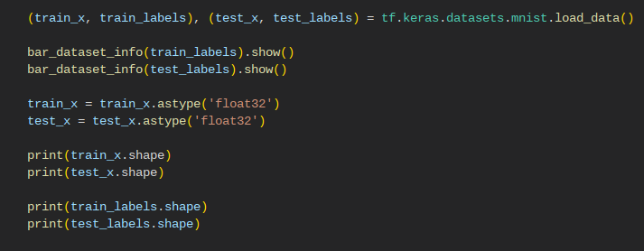

# Лабораторная работа по курсу "Искусственный интеллект"
# Многослойный персептрон

| Студент | Ежов Н.П. |
|------|------|
| Группа  | М8О-307Б-19 |
| Оценка 1 (свой фреймворк) | *X* |
| Оценка 2 (PyTorch/Tensorflow) | *X* |
| Проверил | Сошников Д.В. |

> *Комментарии проверяющего*
### Задание

Решить задачу классификации для датасетов MNIST, FashionMNIST, CIFAR-10 с помощью 1, 2 и 3-слойного персептрона. Попробовать разные передаточные функции, провести сравнительную оценку решений. Решение сделать двумя способами:
* "С нуля", на основе базовых операций библиотеки numpy. Решение желательно реализовать в виде библиотеки, пригодной для решения более широкго круга задач.
* На основе одного из существующих нейросетевых фреймворков, в соответствии с вариантом задания:
   1. PyTorch
   1. Tensorflow/Keras

> *Номер варианта вычисляется по формуле 1 + (N-1) mod 2, где N - номер студента в списке.*

Решение оформить в файлах [Solution_MyFramework.ipynb](Solution_MyFramework.ipynb) и [Solution.ipynb](Solution.ipynb). 
Отчет по работе и сравнение методов пишется в этом файле после задания.
### Критерии оценки

Первая часть лабораторной работы:

| Сделано | Баллы |
|---------|-------|
| Реализован однослойный персептрон, классифицирующий датасет с точностью >85% | 1 |
| Реализован многослойный персептрон, классифицирующий датасет с точностью >85% | 2 |
| Реализация сделана как библиотека для обучения сетей различных конфигураций, в соответствии с примером | 1 |
| Улучшена архитектура библиотеки, отдельно вынесены алгоритмы обучения, функции потерь | 3 |
| Проведено сравнение различных гиперпараметров, таких, как передаточные функции, число нейронов в промежуточных слоях, функции потерь, с графиками обучения и матрицами неточности | 2 |
| Проведен анализ для датасета FashionMNIST | 1 |

Вторая часть лабораторной работы:

| Сделано | Баллы |
|---------|-------|
| Реализован однослойный персептрон, классифицирующий датасет с точностью >85% | 1 |
| Реализован многослойный персептрон, классифицирующий датасет с точностью >85% | 2 |
| Реализация использует возможности базового фреймворка, включая работу с данными | 3 |
| Проведено сравнение различных гиперпараметров, таких, как передаточные функции, число нейронов в промежуточных слоях, функции потерь, с графиками обучения и матрицами неточности | 2 |
| Проведен анализ для датасета FashionMNIST | 1 |
| Проведен анализ для другого датасета с цветными картинками (CIFAR-10) | 1 |

## Отчёт по работе

### Первая часть ЛР
В первой части ЛР была сделана реализация собственного нейросетевого фреймворка. Реализация была отдельно размещена в файле [Net.py](Net.py)
В классе Net были собраны основные составляющие, которые позволяют создать собственную нейросеть, т.е. в классе Net предусмотрено добавление слоёв произвольной размерности, передаточных функций, также прямо в класс встроены функции вычисления обратного распространения ошибки. Также были добавлены функции для тренировки одной и нескольких эпох, во втором случае также строятся графики изменения значения точности модели в зависимости от эпохи. За пределами класса Net были расположены различные вспомогательные функции, например, ```bar_dataset_info``` позволяет вывести распределение классов в датасете. Реализация слоёв была вынесена в отдельный файл: [Layers.py](Layers.py). В нём есть базовый класс: ```Layer```, в котором есть две функции, ```forward``` и ```backward```, которые переопределяются классами-наследниками. Глобально слои в реализации можно разделить на два частных случая и отдельную категорию: линейный слой, слой для вычисления cross-entropy loss в задачах мультиклассовой классификации, а также категория слоёв, которые называются передаточными функциями. Среди таких были реализованы следующие: ```Softmax```, ```ReLU``` и ```Tanh```.

Посмотрим на результаты работы моделей, созданных при помощи данного нейросетевого фреймворка. Для начала возьмём датасет MNIST. Составим однослойный персептрон.


Как можно заметить, для однослойного персептрона нетрудно добиться точности >= 85% даже за одну эпоху обучения, поэтому перейдём сразу к многослойным перспетронам.


В данной сети использовалось два слоя указанных размерностей, а в качестве передаточной ф-ии был использован гиперболический тангенс. В любом случае, даже такая конфигурация сети показала более чем достойный результат, остальные примеры сетей можно посмотреть в том же ноутбуке. В конце могу добавить, что, при сравнении различных параметров вывел для себя следующую закономерность: при выборе между ```Tanh``` и ```ReLU``` гораздо лучшие результаты показала именно вторая функция; увеличение количества нейронов ведёт к значительному росту времени, требуемому на процесс обучения, а добавление нескольких слоёв помогает получить высокую точность там, где однослойной сетью этого добиться невозможно. Например, при анализе датасета FashionMNIST мне не удалось добиться точности больше 70% для однослойного персептрона, а вот при использовании конфигурации с 3-мя слоями, передаточная функция между которыми - ```ReLU```, была достигнута точность в 87%. Графики и матрицы неточности можно просмотреть в файле с [решением](Solution_MyFramework.ipynb) 

### Вторая часть ЛР
Рассмотрим создание нейросетей различных конфигураций при помощи tensorflow + keras. Заранее отмечу, что для загрузки датасетов были использованы функции из tf.keras.datasets.

Первое, что мы сделаем, это загрузим датасет MNIST, посмотрим распределение классов в тренировочной и валидационной выборке, нормализуем данные и составим из них объект класса ```tf.data.Dataset```




После чего составим первую нейросеть с одним слоем. Да, чисто формально был использован слой под названием ```Flatten```, но это было сделано намеренно - дело в том, что tf.model.fit принимает в качестве аргумента лишь двумерные тензоры, а если измерений в тензоре больше, чем 2, то для передачи на вход используется только последнее измерение. ```Flatten``` решает эту проблему, совмещая все измерения, начиная со второго и до конца, в одно. Фактически это аналог ```np.reshape```, но мне было интересно, как эта проблема решается непосредствено силами фреймворка.


Теперь рассмотрим пример с двумя слоями


При сравнении влияния гиперпараметров была выведена та же закономерность, что и в первой части ЛР.

Для датасета Fashion_MNIST также удалось добиться точности больше 85% при следующей конфигурации:


А вот при анализе датасета CIFAR-10 максимальная точность составила только 40% при следующей конфигурации:


## Материалы для изучения

 * [Реализация своего нейросетевого фреймворка](https://github.com/shwars/NeuroWorkshop/blob/master/Notebooks/IntroMyFw.ipynb)
 * [Введение в PyTorch](https://github.com/shwars/NeuroWorkshop/blob/master/Notebooks/IntroPyTorch.ipynb)
 * [Введение в Tensorflow/Keras](https://github.com/shwars/NeuroWorkshop/blob/master/Notebooks/IntroKerasTF.ipynb)
